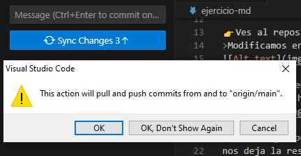
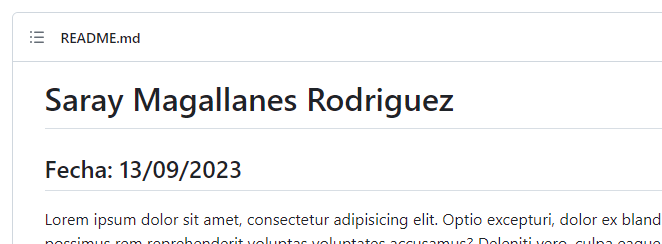

👉1. Crea un repositorio llamado conflictos-
git y añade un readme.md (puedes marcar la pestaña add readme.md cuando lo creas desde GitHub). 2. Añade en el repositorio el siguiente
contenido 3. Clona el repositorio remoto conflictos-git a tu dispositivo (git clone).

>Clonamos el repositorio aqui con "git clone" y añadimos el archivo correspondiente.

👉Modifica desde GitHub, el repositorio
poniendo tu nombre y la fecha de hoy en
lugar del actual.
>Hacemos click en el archivo readme y le damos a editar. Una vez dentro lo editamos y hacemos click en "Commit changes"para hacer un commit.

👉Ves al repositorio local y modifica el nombre por Jaimito Fernández y pon como fecha 22/22/2222.
>Modificamos en el repositorio local.

👉Intenta hacer un push al repositorio remoto.
>Al hacer "push" nos da error.

👉Haz un git pull y ves que Git no puede auto-resolver el conflicto. Por lo que
nos deja la responsabilidad a nosotros como programadores. Haz un git pull y ves que Git no puede auto-resolver el conflicto. Por lo que nos deja la responsabilidad a nosotros como programadores.
>
>

👉Piensa en que versión quieres, es muy importante estar seguro de lo que
queremos hacer para no tener dolores de cabeza y no darle a cualquier opción
sin pensarlo. ¿Qué versión quiero? ¿Con que cambios me quiero quedar? Y
finalmente, soluciona el conflicto.
>Hacemos click en "Accept incoming changes" ya que en este caso me interesa quedarme con la opción en la que sale mi nombre y fecha actual y hacemos click en "complete merge" para que se nos quede ese cambio.
>
>Nos aparecerá esta ventana para hacer el commit.
>
>Y esta otra para hacer también pull y push, hacemos click en OK y se hace completamente.
>
>Vamos a github para ver que los cambios se han hecho correctamente y conflicto solucionado.
>

